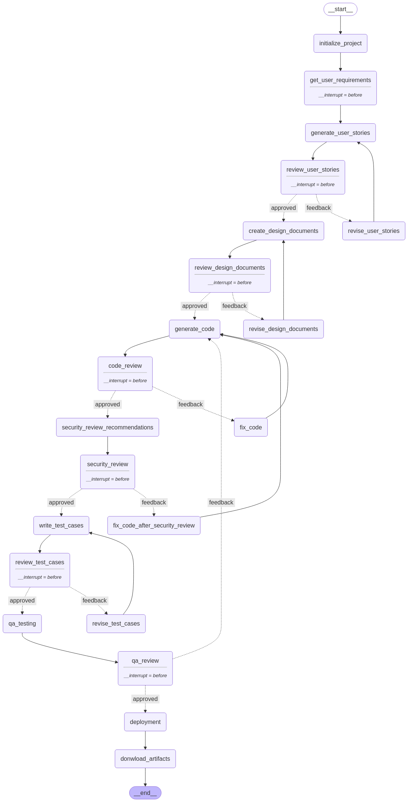

# AI Based SDLC Automation Agent
AI Agent to automate the complete SDLC process starting from user requirements till deployment

## Setup Instruction
- Clone the repo
- Create a virtual environment
- Install the requirements
- Install Docker Desktop
- Pull the Redis image using `docker pull redis`
- Run the Redis container using `docker run -p 6379:6379 redis` (Docker is used to store the state of the graph in Redis)
- Run the streamlit app using `streamlit run app.py`

## Workflow Graph

### TODO
- Fast API Integration
- Deploy as a docker on AWS